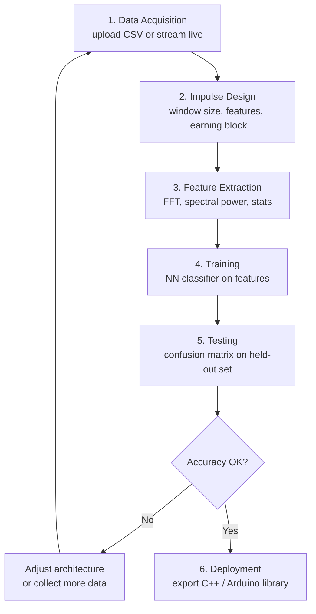

import TawkWidget from '../../../../components/TawkWidget.astro';
import UniversalContentContributors from '../../../../components/UniversalContentContributors.astro';
import InArticleAd from '../../../../components/InArticleAd.astro';
import Copyright from '../../../../components/Copyright.astro';
import BionicText from '../../../../components/BionicText.astro';
import TailwindWrapper from '../../../../components/TailwindWrapper.jsx';
import { Tabs, TabItem } from '@astrojs/starlight/components';
import { Card, CardGrid, Badge, Steps, LinkButton, FileTree } from '@astrojs/starlight/components';

<UniversalContentContributors 
  contributors={frontmatter.contributors}
/>


import EdgeAiTinymlComments from '../../../../components/edge-ai-tinyml/EdgeAiTinymlComments.astro';

Real sensor data is messy. Collecting it, labeling it, extracting useful features, and iterating on models by hand is tedious and error prone. Edge Impulse is a cloud platform that handles the entire pipeline from raw sensor data to a deployable C++ library. In this lesson you will collect accelerometer data from an MPU6050 connected to an ESP32, upload it to Edge Impulse, train a motion classifier that distinguishes between idle, walking, and running, and deploy the quantized model back to the ESP32 for real-time inference. #EdgeImpulse #TinyML #MotionClassifier

```text
  Edge Impulse Workflow
  ──────────────────────────────────────────
  ESP32 + MPU6050
    │
    │ Serial forwarder
    ▼
  Edge Impulse Studio (cloud)
    │
    ├──► 1. Data Collection (label samples)
    ├──► 2. Impulse Design
    │       ├── Spectral Features (FFT)
    │       └── Neural Network Classifier
    ├──► 3. Train Model (cloud GPU)
    ├──► 4. Test on held-out data
    └──► 5. Deploy as C++ Library
              │
              ▼
         ESP32 firmware (inference)
```

## What We Are Building

<Card title="Motion Classifier" icon="star">
A wearable-style motion classifier that reads 3-axis accelerometer data from an MPU6050 at 50 Hz and classifies the current activity as idle, walking, or running. The classifier runs entirely on the ESP32 with no cloud connectivity required after deployment. An LED indicates the current state: off for idle, slow blink for walking, fast blink for running.
</Card>

**Project specifications:**

| Parameter | Value |
|-----------|-------|
| MCU | ESP32 (any dev board) |
| Sensor | MPU6050 (I2C, 3.3V) |
| Sample rate | 50 Hz (accelerometer X, Y, Z) |
| Classes | idle, walking, running |
| Window size | 2 seconds (100 samples) |
| Inference platform | Edge Impulse C++ library on ESP-IDF |
| Output | Serial log + LED blink pattern |

### Bill of Materials

| Ref | Component | Quantity | Notes |
|-----|-----------|----------|-------|
| U1 | ESP32 DevKitC | 1 | Reuse from previous courses |
| U2 | MPU6050 breakout module | 1 | GY-521 or equivalent |
| D1 | LED (any color) | 1 | For activity indicator |
| R1 | 220 ohm resistor | 1 | Current limiting for LED |
| | Breadboard + jumper wires | 1 set | |

```text
  Impulse Design (Edge Impulse)
  ──────────────────────────────────────────
  Raw Data         Processing      Learning
  ─────────        ──────────      ────────
  ┌──────────┐    ┌──────────┐   ┌────────┐
  │ Accel X  │    │ Spectral │   │ Neural │
  │ Accel Y  ├───►│ Features ├──►│Network │
  │ Accel Z  │    │ (FFT,    │   │Classif.│
  │ 50 Hz    │    │  peaks,  │   │        │
  │ 2s window│    │  energy) │   │ idle   │
  └──────────┘    └──────────┘   │ walk   │
  100 samples      33 features   │ run    │
  x 3 axes                       └────────┘
```

### Wiring

| MPU6050 Pin | ESP32 Pin | Function |
|-------------|-----------|----------|
| VCC | 3.3V | Power |
| GND | GND | Ground |
| SCL | GPIO 22 | I2C clock |
| SDA | GPIO 21 | I2C data |

| LED | ESP32 Pin |
|-----|-----------|
| Anode (through 220R) | GPIO 2 |
| Cathode | GND |

## Edge Impulse Overview

<InArticleAd />


Edge Impulse provides a web-based pipeline with these stages:



<Steps>
1. **Data Acquisition.**
   Upload sensor data as CSV or stream it live via the Edge Impulse CLI. Each sample is labeled with its class.

2. **Impulse Design.**
   Define the processing pipeline: input axes, window size, feature extraction block (spectral analysis, MFE, raw), and learning block (classification NN, anomaly detection).

3. **Feature Extraction.**
   The platform computes features (FFT peaks, spectral power, statistical moments) for each window and visualizes them in a 2D feature explorer.

4. **Training.**
   A neural network classifier trains on the extracted features. You control the architecture (number of layers, neurons, dropout) and training parameters (epochs, learning rate).

5. **Testing.**
   The platform evaluates accuracy on a held-out test set and shows the confusion matrix.

6. **Deployment.**
   Export a quantized model as a C++ library, Arduino library, or WebAssembly. The C++ library drops directly into an ESP-IDF project.
</Steps>

Create a free account at [edgeimpulse.com](https://edgeimpulse.com) and create a new project called "Motion Classifier".

## Step 1: Data Collection Firmware

<InArticleAd />


The first task is to write firmware that reads the MPU6050 at 50 Hz and outputs the data in a format that Edge Impulse can ingest.

<Tabs>
<TabItem label="MicroPython (Data Collection)">
```python
# data_collection.py
# Stream MPU6050 accelerometer data over serial for Edge Impulse ingestion
# Format: timestamp, accX, accY, accZ (CSV)

from machine import I2C, Pin
import time

# MPU6050 registers
MPU6050_ADDR = 0x68
PWR_MGMT_1 = 0x6B
ACCEL_XOUT_H = 0x3B
ACCEL_CONFIG = 0x1C

# Initialize I2C
i2c = I2C(0, scl=Pin(22), sda=Pin(21), freq=400000)

# Wake up MPU6050
i2c.writeto_mem(MPU6050_ADDR, PWR_MGMT_1, b'\x00')
time.sleep_ms(100)

# Set accelerometer range to +/- 2g
i2c.writeto_mem(MPU6050_ADDR, ACCEL_CONFIG, b'\x00')

def read_accel():
    """Read 3-axis accelerometer data, return as (x, y, z) in g."""
    data = i2c.readfrom_mem(MPU6050_ADDR, ACCEL_XOUT_H, 6)
    ax = (data[0] << 8 | data[1])
    ay = (data[2] << 8 | data[3])
    az = (data[4] << 8 | data[5])
    # Convert from signed 16-bit
    if ax > 32767: ax -= 65536
    if ay > 32767: ay -= 65536
    if az > 32767: az -= 65536
    # Convert to g (16384 LSB/g at +/- 2g range)
    return ax / 16384.0, ay / 16384.0, az / 16384.0

# Collection parameters
SAMPLE_RATE_HZ = 50
SAMPLE_INTERVAL_MS = 1000 // SAMPLE_RATE_HZ
DURATION_S = 10  # collect 10 seconds per recording

print("MPU6050 data collection ready.")
print(f"Sample rate: {SAMPLE_RATE_HZ} Hz, Duration: {DURATION_S} s")
print("Press the BOOT button or send 'start' to begin recording.")
print("")

# Wait for trigger
input("Press Enter to start recording...")

print("timestamp,accX,accY,accZ")
start_time = time.ticks_ms()
num_samples = SAMPLE_RATE_HZ * DURATION_S

for i in range(num_samples):
    target_time = start_time + (i * SAMPLE_INTERVAL_MS)
    ax, ay, az = read_accel()
    ts = time.ticks_diff(time.ticks_ms(), start_time)
    print(f"{ts},{ax:.4f},{ay:.4f},{az:.4f}")
    # Wait for next sample
    now = time.ticks_ms()
    wait = time.ticks_diff(target_time, now)
    if wait > 0:
        time.sleep_ms(wait)

print("Recording complete.")
```
</TabItem>
<TabItem label="ESP-IDF C (Data Collection)">
```c
// main.c - Data collection firmware for Edge Impulse
// Streams MPU6050 accelerometer data as CSV over UART

#include <stdio.h>
#include <string.h>
#include "freertos/FreeRTOS.h"
#include "freertos/task.h"
#include "driver/i2c.h"
#include "esp_timer.h"
#include "esp_log.h"

#define MPU6050_ADDR        0x68
#define MPU6050_PWR_MGMT_1  0x6B
#define MPU6050_ACCEL_XOUT_H 0x3B
#define MPU6050_ACCEL_CONFIG 0x1C

#define I2C_MASTER_NUM      I2C_NUM_0
#define I2C_SDA_PIN         21
#define I2C_SCL_PIN         22
#define I2C_FREQ_HZ         400000

#define SAMPLE_RATE_HZ      50
#define DURATION_S          10

static const char *TAG = "data_collect";

static esp_err_t mpu6050_write_byte(uint8_t reg, uint8_t val) {
    uint8_t buf[2] = {reg, val};
    return i2c_master_write_to_device(I2C_MASTER_NUM, MPU6050_ADDR,
                                       buf, 2, pdMS_TO_TICKS(100));
}

static esp_err_t mpu6050_read_bytes(uint8_t reg, uint8_t *data, size_t len) {
    return i2c_master_write_read_device(I2C_MASTER_NUM, MPU6050_ADDR,
                                         &reg, 1, data, len, pdMS_TO_TICKS(100));
}

static void i2c_init(void) {
    i2c_config_t conf = {
        .mode = I2C_MODE_MASTER,
        .sda_io_num = I2C_SDA_PIN,
        .scl_io_num = I2C_SCL_PIN,
        .sda_pullup_en = GPIO_PULLUP_ENABLE,
        .scl_pullup_en = GPIO_PULLUP_ENABLE,
        .master.clk_speed = I2C_FREQ_HZ,
    };
    i2c_param_config(I2C_MASTER_NUM, &conf);
    i2c_driver_install(I2C_MASTER_NUM, conf.mode, 0, 0, 0);
}

static void mpu6050_init(void) {
    mpu6050_write_byte(MPU6050_PWR_MGMT_1, 0x00);  // Wake up
    vTaskDelay(pdMS_TO_TICKS(100));
    mpu6050_write_byte(MPU6050_ACCEL_CONFIG, 0x00); // +/- 2g
}

static void read_accel(float *ax, float *ay, float *az) {
    uint8_t data[6];
    mpu6050_read_bytes(MPU6050_ACCEL_XOUT_H, data, 6);
    int16_t raw_x = (int16_t)((data[0] << 8) | data[1]);
    int16_t raw_y = (int16_t)((data[2] << 8) | data[3]);
    int16_t raw_z = (int16_t)((data[4] << 8) | data[5]);
    *ax = raw_x / 16384.0f;
    *ay = raw_y / 16384.0f;
    *az = raw_z / 16384.0f;
}

void app_main(void) {
    i2c_init();
    mpu6050_init();

    ESP_LOGI(TAG, "MPU6050 initialized. Starting data collection...");
    vTaskDelay(pdMS_TO_TICKS(2000));  // 2 second delay to get ready

    printf("timestamp,accX,accY,accZ\n");

    int64_t start_us = esp_timer_get_time();
    int total_samples = SAMPLE_RATE_HZ * DURATION_S;
    int interval_us = 1000000 / SAMPLE_RATE_HZ;

    for (int i = 0; i < total_samples; i++) {
        float ax, ay, az;
        read_accel(&ax, &ay, &az);

        int64_t elapsed_ms = (esp_timer_get_time() - start_us) / 1000;
        printf("%lld,%.4f,%.4f,%.4f\n", elapsed_ms, ax, ay, az);

        // Wait for next sample
        int64_t target_us = start_us + ((int64_t)(i + 1) * interval_us);
        int64_t now_us = esp_timer_get_time();
        if (target_us > now_us) {
            vTaskDelay(pdMS_TO_TICKS((target_us - now_us) / 1000));
        }
    }

    ESP_LOGI(TAG, "Data collection complete. %d samples collected.", total_samples);
}
```
</TabItem>
</Tabs>

## Step 2: Collecting and Labeling Data

<InArticleAd />


You need at least 3 minutes of data per class. For three classes (idle, walking, running), plan to collect about 10 minutes total.

<Steps>
1. **Flash the data collection firmware** to your ESP32.

2. **Collect idle data.** Place the ESP32 + MPU6050 on a flat table. Start recording. Save the serial output to a file: `idle_01.csv`, `idle_02.csv`, etc. Collect at least 6 recordings of 10 seconds each.

3. **Collect walking data.** Hold the sensor board in your hand (or strap it to your wrist/ankle) and walk at a normal pace. Save as `walking_01.csv`, etc.

4. **Collect running data.** Same setup, but jog or run. Save as `running_01.csv`, etc.

5. **Capture serial output to files** using a terminal tool (see commands below).
</Steps>

Capture serial output with any of these methods:

```bash
# Using screen with logging
screen -L -Logfile idle_01.csv /dev/ttyUSB0 115200

# Or using minicom
minicom -D /dev/ttyUSB0 -b 115200 -C idle_01.csv

# Or using Python
python -c "
import serial, sys
ser = serial.Serial('/dev/ttyUSB0', 115200, timeout=15)
with open(sys.argv[1], 'w') as f:
    while True:
        line = ser.readline().decode('utf-8', errors='ignore').strip()
        if line:
            print(line)
            f.write(line + '\n')
        if 'complete' in line.lower():
            break
" idle_01.csv
```

## Step 3: Uploading Data to Edge Impulse

<InArticleAd />


You can upload data through the Edge Impulse web interface or the CLI.

### Using the Edge Impulse CLI

```bash
# Install the CLI
npm install -g edge-impulse-cli

# Login (first time only)
edge-impulse-login

# Upload a CSV file with a label
edge-impulse-uploader --label idle --category training idle_01.csv
edge-impulse-uploader --label idle --category training idle_02.csv
edge-impulse-uploader --label walking --category training walking_01.csv
edge-impulse-uploader --label running --category training running_01.csv

# Reserve some files for testing
edge-impulse-uploader --label idle --category testing idle_06.csv
edge-impulse-uploader --label walking --category testing walking_06.csv
edge-impulse-uploader --label running --category testing running_06.csv
```

### Using the Web Interface

1. Go to your Edge Impulse project, select **Data acquisition**.
2. Click **Upload data**, select your CSV files, set the label, and choose training or testing split.
3. Make sure the CSV header matches: `timestamp,accX,accY,accZ`.

## Step 4: Designing the Impulse

<InArticleAd />


In the Edge Impulse Studio, go to **Impulse design**.

### Input Block

| Setting | Value |
|---------|-------|
| Input axes | accX, accY, accZ |
| Window size | 2000 ms |
| Window increase | 500 ms |
| Frequency | 50 Hz |

The window size of 2 seconds (100 samples at 50 Hz) gives the model enough context to distinguish between activities. The window increase of 500 ms means the model evaluates overlapping windows during inference.

### Processing Block: Spectral Analysis

Select **Spectral Analysis** as the processing block. This computes frequency-domain features from each axis:

- FFT length, spectral power in configurable bins
- RMS, peak-to-peak, mean, standard deviation
- Spectral entropy and skewness

These features are much more discriminative than raw time-domain samples. Walking has a characteristic frequency around 1.5 to 2 Hz. Running is faster (2.5 to 4 Hz). Idle has minimal spectral power.

### Learning Block: Classification

Select **Classification** as the learning block.

| Setting | Recommended Value |
|---------|-------------------|
| Number of training cycles | 100 |
| Learning rate | 0.0005 |
| Minimum confidence rating | 0.6 |
| Neural network architecture | 2 hidden layers, 20 and 10 neurons |
| Dropout | 0.25 |

## Step 5: Training and Evaluating

<InArticleAd />


Click **Start training**. Training takes 1 to 3 minutes for this dataset size. After training, Edge Impulse shows:

- **Accuracy** on the validation split (aim for 90%+ with clean data)
- **Confusion matrix** showing per-class precision and recall
- **On-device performance estimate** (inference time and RAM usage for your target MCU)

A typical confusion matrix for a well-collected dataset:

|  | Predicted Idle | Predicted Walking | Predicted Running |
|--|----------------|-------------------|-------------------|
| **Actual Idle** | 96% | 3% | 1% |
| **Actual Walking** | 2% | 93% | 5% |
| **Actual Running** | 0% | 4% | 96% |

If accuracy is low, check for:
- Mislabeled samples (review the data in the Data acquisition tab)
- Insufficient data (add more recordings)
- Sensor mounting inconsistency (always mount the sensor the same way)

Go to **Model testing** and run the test set. This evaluates on data the model has never seen.

## Step 6: Exporting the C++ Library

<InArticleAd />


<Steps>
1. Go to **Deployment** in Edge Impulse Studio.
2. Select **C++ library**.
3. Choose **Quantized (int8)** for optimization.
4. Click **Build**. Edge Impulse generates a `.zip` file containing the model, feature extraction code, and inference API.
5. Download and extract the zip.
</Steps>

The extracted library has this structure:

<FileTree>
- edge-impulse-sdk/
  - classifier/
  - dsp/
  - porting/
  - tensorflow/
- model-parameters/
  - model_metadata.h
  - model_variables.h
- tflite-model/
  - trained_model_compiled.cpp
- edge-impulse-sdk.cmake
</FileTree>

## Step 7: Integrating with ESP-IDF

<InArticleAd />


Create a new ESP-IDF project and copy the Edge Impulse library into the `components` directory.

<FileTree>
- motion_classifier/
  - CMakeLists.txt
  - main/
    - CMakeLists.txt
    - main.cpp
  - components/
    - edge-impulse-sdk/
</FileTree>

### Inference Firmware

```cpp
// main/main.cpp
// Real-time motion classification using Edge Impulse on ESP32

#include <cstdio>
#include <cstring>
#include "freertos/FreeRTOS.h"
#include "freertos/task.h"
#include "driver/i2c.h"
#include "driver/gpio.h"
#include "esp_timer.h"
#include "esp_log.h"

// Edge Impulse includes
#include "edge-impulse-sdk/classifier/ei_run_classifier.h"
#include "edge-impulse-sdk/dsp/numpy.hpp"

#define MPU6050_ADDR         0x68
#define I2C_SDA_PIN          21
#define I2C_SCL_PIN          22
#define LED_PIN              GPIO_NUM_2
#define SAMPLE_RATE_HZ       50

static const char *TAG = "motion_cls";

// Forward declarations
static void i2c_init(void);
static void mpu6050_init(void);
static void read_accel(float *ax, float *ay, float *az);

// Buffer for one inference window
// EI_CLASSIFIER_DSP_INPUT_FRAME_SIZE = axes * window_samples = 3 * 100 = 300
static float features[EI_CLASSIFIER_DSP_INPUT_FRAME_SIZE];

// Callback that provides features to the classifier
static int get_feature_data(size_t offset, size_t length, float *out_ptr) {
    memcpy(out_ptr, features + offset, length * sizeof(float));
    return 0;
}

static void led_init(void) {
    gpio_reset_pin(LED_PIN);
    gpio_set_direction(LED_PIN, GPIO_MODE_OUTPUT);
    gpio_set_level(LED_PIN, 0);
}

// LED blink patterns for each class
static void indicate_class(const char *label) {
    if (strcmp(label, "idle") == 0) {
        gpio_set_level(LED_PIN, 0);  // LED off
    } else if (strcmp(label, "walking") == 0) {
        // Slow blink (toggle)
        static int state = 0;
        state = !state;
        gpio_set_level(LED_PIN, state);
    } else if (strcmp(label, "running") == 0) {
        // Fast blink (always toggle)
        static int state2 = 0;
        state2 = !state2;
        gpio_set_level(LED_PIN, state2);
    }
}

extern "C" void app_main(void) {
    i2c_init();
    mpu6050_init();
    led_init();

    ESP_LOGI(TAG, "Motion classifier starting");
    ESP_LOGI(TAG, "Window size: %d ms, Features: %d, Labels: %d",
             EI_CLASSIFIER_INTERVAL_MS * EI_CLASSIFIER_RAW_SAMPLE_COUNT,
             EI_CLASSIFIER_DSP_INPUT_FRAME_SIZE,
             EI_CLASSIFIER_LABEL_COUNT);

    int interval_ms = 1000 / SAMPLE_RATE_HZ;
    int window_samples = EI_CLASSIFIER_RAW_SAMPLE_COUNT;  // 100 for 2s at 50 Hz

    while (1) {
        // Collect one window of accelerometer data
        for (int i = 0; i < window_samples; i++) {
            float ax, ay, az;
            read_accel(&ax, &ay, &az);
            features[i * 3 + 0] = ax;
            features[i * 3 + 1] = ay;
            features[i * 3 + 2] = az;
            vTaskDelay(pdMS_TO_TICKS(interval_ms));
        }

        // Run classifier
        signal_t signal;
        signal.total_length = EI_CLASSIFIER_DSP_INPUT_FRAME_SIZE;
        signal.get_data = &get_feature_data;

        ei_impulse_result_t result = {0};
        EI_IMPULSE_ERROR err = run_classifier(&signal, &result, false);

        if (err != EI_IMPULSE_OK) {
            ESP_LOGE(TAG, "Classifier error: %d", err);
            continue;
        }

        // Find the class with highest confidence
        float max_val = 0.0f;
        const char *max_label = "unknown";
        for (size_t ix = 0; ix < EI_CLASSIFIER_LABEL_COUNT; ix++) {
            ESP_LOGI(TAG, "  %s: %.4f",
                     result.classification[ix].label,
                     result.classification[ix].value);
            if (result.classification[ix].value > max_val) {
                max_val = result.classification[ix].value;
                max_label = result.classification[ix].label;
            }
        }

        ESP_LOGI(TAG, "=> %s (%.1f%%) | DSP: %d ms, Classification: %d ms",
                 max_label, max_val * 100.0f,
                 result.timing.dsp, result.timing.classification);

        indicate_class(max_label);
    }
}

// I2C and MPU6050 driver functions

static void i2c_init(void) {
    i2c_config_t conf = {
        .mode = I2C_MODE_MASTER,
        .sda_io_num = I2C_SDA_PIN,
        .scl_io_num = I2C_SCL_PIN,
        .sda_pullup_en = GPIO_PULLUP_ENABLE,
        .scl_pullup_en = GPIO_PULLUP_ENABLE,
        .master = { .clk_speed = 400000 },
    };
    i2c_param_config(I2C_NUM_0, &conf);
    i2c_driver_install(I2C_NUM_0, conf.mode, 0, 0, 0);
}

static void mpu6050_init(void) {
    uint8_t buf[2];
    // Wake up
    buf[0] = 0x6B; buf[1] = 0x00;
    i2c_master_write_to_device(I2C_NUM_0, MPU6050_ADDR, buf, 2, pdMS_TO_TICKS(100));
    vTaskDelay(pdMS_TO_TICKS(100));
    // Accel range +/- 2g
    buf[0] = 0x1C; buf[1] = 0x00;
    i2c_master_write_to_device(I2C_NUM_0, MPU6050_ADDR, buf, 2, pdMS_TO_TICKS(100));
}

static void read_accel(float *ax, float *ay, float *az) {
    uint8_t reg = 0x3B;
    uint8_t data[6];
    i2c_master_write_read_device(I2C_NUM_0, MPU6050_ADDR,
                                  &reg, 1, data, 6, pdMS_TO_TICKS(100));
    int16_t raw_x = (int16_t)((data[0] << 8) | data[1]);
    int16_t raw_y = (int16_t)((data[2] << 8) | data[3]);
    int16_t raw_z = (int16_t)((data[4] << 8) | data[5]);
    *ax = raw_x / 16384.0f;
    *ay = raw_y / 16384.0f;
    *az = raw_z / 16384.0f;
}
```

## Step 8: Build and Flash

<InArticleAd />


The Edge Impulse SDK integrates with ESP-IDF through CMake. Your top-level `CMakeLists.txt` needs to include the SDK:

```cmake
# motion_classifier/CMakeLists.txt
cmake_minimum_required(VERSION 3.16)

set(EXTRA_COMPONENT_DIRS "components")

include($ENV{IDF_PATH}/tools/cmake/project.cmake)
project(motion_classifier)
```

```cmake
# motion_classifier/main/CMakeLists.txt
idf_component_register(
    SRCS "main.cpp"
    INCLUDE_DIRS "."
    REQUIRES edge-impulse-sdk
)
```

```bash
cd motion_classifier
idf.py set-target esp32
idf.py build
idf.py -p /dev/ttyUSB0 flash monitor
```

## Running Real-Time Inference

<InArticleAd />


With the inference firmware running, move the sensor through the three activities. The serial monitor shows output like:

```
I (1234) motion_cls: Motion classifier starting
I (1234) motion_cls: Window size: 2000 ms, Features: 300, Labels: 3
I (3250) motion_cls:   idle: 0.9531
I (3250) motion_cls:   walking: 0.0312
I (3250) motion_cls:   running: 0.0156
I (3250) motion_cls: => idle (95.3%) | DSP: 12 ms, Classification: 3 ms
I (5270) motion_cls:   idle: 0.0625
I (5270) motion_cls:   walking: 0.8750
I (5270) motion_cls:   running: 0.0625
I (5270) motion_cls: => walking (87.5%) | DSP: 12 ms, Classification: 3 ms
```

### Performance on ESP32

| Metric | Typical Value |
|--------|---------------|
| DSP (feature extraction) time | 10 to 15 ms |
| Classification (inference) time | 2 to 5 ms |
| Total per-window time | 12 to 20 ms |
| Model flash usage | 15 to 40 KB |
| RAM for inference | 8 to 20 KB |
| Overall accuracy | 90 to 97% (depends on data quality) |

The DSP step (spectral feature extraction) takes longer than the neural network inference itself. This is typical for Edge Impulse models because the spectral analysis involves FFTs and statistical calculations.

## Accuracy Evaluation

<InArticleAd />


### Common Issues and Fixes

<CardGrid>
  <Card title="Low accuracy on one class" icon="warning">
  Check that you have enough data for that class. Edge Impulse recommends at least 3 minutes per class. Also verify that the sensor was mounted consistently across all recordings.
  </Card>

  <Card title="Confusion between walking and running" icon="warning">
  These classes can overlap if walking speed is high or running speed is low. Collect data at clearly different speeds. You can also add a fourth class ("jogging") to create a buffer zone.
  </Card>

  <Card title="High training accuracy, low test accuracy" icon="warning">
  This is overfitting. Reduce the network size (fewer neurons), increase dropout, or collect more varied training data.
  </Card>

  <Card title="Model too large for flash" icon="warning">
  Reduce the number of spectral features in the processing block. Fewer FFT bins and fewer statistical features shrink the input vector, which allows a smaller network.
  </Card>
</CardGrid>

### Improving the Model

If your initial accuracy is below 85%, try these steps in order:

<Steps>
1. **Review and clean your data.** In Edge Impulse, go to Data acquisition and listen to / inspect each sample. Remove any mislabeled or corrupted recordings.

2. **Increase training data.** Collect 5 more recordings per class with varied conditions (different walking surfaces, different sensor orientations).

3. **Tune the processing block.** Experiment with different FFT lengths (128, 256, 512) and enable/disable specific features.

4. **Adjust the neural network.** Add a third hidden layer, or increase neurons to 32 and 16. Watch the estimated RAM usage to stay within the ESP32's budget.

5. **Retrain and test.** Each iteration should improve accuracy by 2 to 5 percentage points.
</Steps>

## Exercises

<InArticleAd />


<CardGrid>
  <Card title="Exercise 1: Add a Fourth Class" icon="pencil">
  Add "jumping" as a fourth activity. Collect data, retrain, and evaluate how it affects the confusion matrix.
  </Card>

  <Card title="Exercise 2: MQTT Integration" icon="pencil">
  After classifying the activity, publish the result to an MQTT broker over Wi-Fi. This connects your edge classifier to a cloud dashboard (similar to the [IoT Systems course](/education/iot-systems/)).
  </Card>

  <Card title="Exercise 3: Sliding Window" icon="pencil">
  Modify the firmware to use a sliding window instead of collecting a fresh window each time. Shift the buffer by 500 ms (25 samples) and re-run inference for faster response time.
  </Card>

  <Card title="Exercise 4: Anomaly Detection" icon="pencil">
  In Edge Impulse, add an Anomaly Detection (K-means) block alongside the classifier. Deploy the combined model and test what happens when you perform an untrained motion (e.g., shaking the sensor vigorously).
  </Card>
</CardGrid>

## What Comes Next

<InArticleAd />


You have now used Edge Impulse to build a complete data-to-deployment pipeline with real sensor data. In the next lesson, you will go deeper into the TensorFlow Lite for Microcontrollers runtime. You will train a gesture classifier locally in TensorFlow (no cloud platform), convert it manually, and deploy it on both an ESP32 and an STM32 to compare cross-platform performance.

<EdgeAiTinymlComments />


<InArticleAd />
<TawkWidget />
<Copyright />